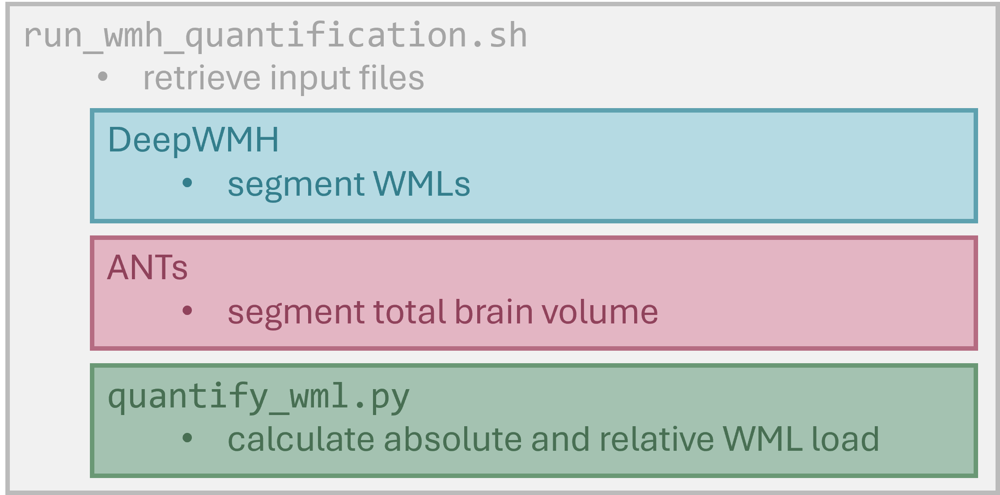

# Quantification of WML Load in Fabry Disease

This repository contains code for a fully automated image processing pipeline for the recognition and quantification of white matter lesions (WMLs) from T2 FLAIR brain MRI scans. 

## This Repository

The code in this repository is made for use on the **UK Biobank Research Analysis Platform (UKB RAP)**.

The `docker/` folder contains a Docker image file for use with the Swiss Army Knife application, as well as a subdirectory with the files used to build the docker image (missing the required dependencies). Additionally, the folder contains two `requirements.txt` files, listing all utilized Python (`pip freeze`) and system dependencies (`dpkg -l`) and their versions. The `notebooks/` folder contains some Jupyter Notebooks used for the analysis of the measurements and visualization of the segmentations returned by the Docker execution. 

Due to data privacy, we cannot share any data available from the UK Biobank database. Instead, we are publishing the results of the image processing pipeline, as well as the statistical tests and plots we have created as part of our analyses.

## WML Quantification Pipeline

Here is a rough outline of what our pipeline does:

1. Reads and unpacks input files selected in the Swiss Army Knife application,
2. Segments WMLs using DeepWMH [[1]](#1),
3. Segments the total brain volume using ANTs [[2]](#2),
4. Quantifies the WML load as absolute lesion volume in ml and relative lesion volume as WML volume to brain volume ratio.

## How to Use

To use our pipeline:

1. Download the Docker image and the script files in the `docker/` directory and upload them to your project on the UKB RAP,
2. Download the NKI Template, which is linked in the ANTs GitHub repostiory [[2]](#2), upload it to your project and unpack the archive. We have added the suffix `NKI_` to the template files, if your filenames are different, you have to change the template file names in the `run_wmh_quantification_nki.sh` Bash script.
3. Start a fresh Swiss Army Knife execution. In the UI, select a suitable instance type. We have tested `mem1_hdd1_v2_x4` (no GPU support), but any GPU or non-GPU instance should be compatible, given enough storage space and memory.
5. In the Inputs tab, select the input files:
     - Select the `run_wmh_quantification_nki.sh` and `quantify_wml.py` scripts and the `NKI_T_template.nii.gz` and `NKI_T_template_BrainCerebellumProbabilityMask.nii.gz` template files,
     - Then, choose up to 6 T2 FLAIR brain MRI scans that should be processed,
6. As the platform file, select the Docker image.
7. Under the Common drop down menu, insert the following command into the command line: `bash run_wmh_quantification_nki.sh`.
8. In the Outputs tab, select any folder you want your output saved to.
9. Finally, start the analysis.

After the processing is done, the selected output folder will contain these files:
- An `input/` directory, containing the selected input images,
- An `intermediate.tar.gz` file, containing all outputs of the DeepWMH and ANTs executions, including the segmentations
- And an `output/` folder, containing a `lesion_volumes.csv` file with the measured absolute and relative WML loads for all inputs.

## Feedback

If you found an issue with the code or have trouble with it, please feel free to open an Issue. If you have a good idea for improvement, please reach out to magdalena.schuettler@stud-mail.uni-wuerzburg.de or markus.ankenbrand@uni-wuerzburg.de.

## References 

<a id="1">[1]</a> 
Liu, C., Zhuo, Z., Qu, L., Jin, Y., Hua, T., Xu, J., Tan, G., Li, Y., Duan, Y., Wang, T., Zhang, Z., Zhang, Y., Chen, R., Yu, P., Zhang, P., Shi, Y., Zhang, J., Tian, D., Li, R., . . . Ye, C. (2024). DeepWMH: A deep learning tool for accurate white matter hyperintensity segmentation without requiring manual annotations for training. Science Bulletin, 69(7), 872–875. doi: [10.1016/j.scib.2024.01.034](https://doi.org/10.1016/j.scib.2024.01.034).

<a id="2">[2]</a> 
Tustison, N. J., Cook, P. A., Holbrook, A. J., Johnson, H. J., Muschelli, J., Devenyi, G. A., Duda, J. T., Das, S. R., Cullen, N. C., Gillen, D. L., Yassa, M. A., Stone, J. R., Gee, J. C., & Avants, B. B. (2021). The ANTsX ecosystem for quantitative biological and medical imaging. Scientific Reports, 11(1). doi: [10.1038/s41598-021-87564-6](https://doi.org/10.1038/s41598-021-87564-6).
